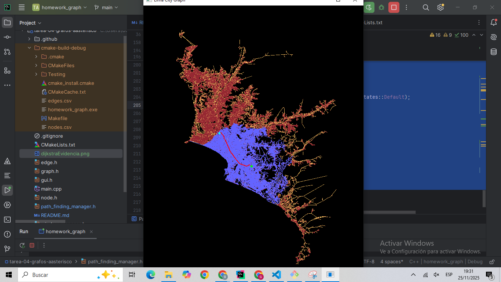
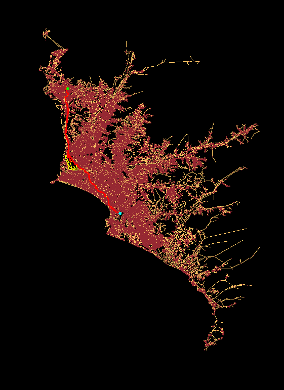

[](https://classroom.github.com/a/5zgGDtf4)
[](https://classroom.github.com/online_ide?assignment_repo_id=21695282&assignment_repo_type=AssignmentRepo)
# Tarea de Grafos

## Integrantes: 
- 1 Gerard Iruri Espinoza
- 2 Anyeli Tamara
- 3 Yeimi Varela

## Objetivo: 
El objetivo de esta tarea es implementar un **Path Finder** para la ciudad de Lima. 

<p align="center">
    
</p>

## Dependencias

Para esta tarea se solicita utilizar ```C++17``` y la librería ```SFML 2.5```

- Para instalar ```SFML 2.5```:

    - [Windows](https://www.youtube.com/watch?v=HkPRG0vfObc)
    - [MacOS y Linux](https://www.youtube.com/playlist?list=PLvv0ScY6vfd95GMoMe2zc4ZgGxWYj3vua)

Cuando se instale la librería, probar que las siguientes líneas del ```CMakeLists.txt``` encuentren la librería adecuadamente.
```cmake
find_package(SFML 2.5 COMPONENTS graphics window REQUIRED)
if(SFML_FOUND)
    target_link_libraries(${PROJECT_NAME} PRIVATE sfml-graphics sfml-window)
else()
    message("SFML not found")
endif()
```

## Dataset
El dataset consiste de dos csv:

- *nodes.csv*

    


- *edges.csv*

    


## Algoritmos
Se les solicita implementar tres algoritmos para busqueda en grafos

- *Dijkstra*

- *Best First Search*

- *A**

Además:
- Analice la complejidad computacional de los tres algoritmos de acuerdo a su propia implementación.
- Puede considere como heuristica la distancia en linea recta.
- **Debe realizar un pequeño video (2 min) mostrando la funcionalidad visual de cada algoritmo**

## Diagrama de clases UML 


----------
> **Créditos:** Juan Diego Castro Padilla [juan.castro.p@utec.edu.pe](mailto:juan.castro.p@utec.edu.pe)


### Dijkstra
Evidencia funcionamiento Dijkstra:
- Lineas azules: arbol que Dijkstra exploró
- Linea roja: camino mínimo


Complejidad temporal:
Sea V el número de nodos y E el número de aristas del grafo. 
En esta implementación de Dijkstra: 
Se inicializan las distancias con un recorrido sobre todos los nodos: O(∣V∣)
La cola de prioridad pq está implementada con std::set, que internamente es un árbol balanceado: Cada extracción del nodo con menor distancia (pq.begin() + erase) cuesta O(log∣V∣). Cada actualización de distancia hace un erase + insert en pq, cada uno O(log∣V∣). 
Cada arista se “relaja” a lo sumo una vez (en un grafo dirigido) o dos veces (en uno no dirigido), lo que sigue siendo O(∣E∣) iteraciones del bucle interno. Por tanto, el coste total (ignorando el coste de render() y de la visualización) es: T(∣V∣,∣E∣)=O(∣V∣log∣V∣)+O(∣E∣log∣V∣)=O((∣V∣+∣E∣)log∣V∣)


Complejidad Espacial:
Espacio adicional usado por el algoritmo (sin contar la estructura del grafo): 
dist: std::unordered_map<Node*, double> -> almacena una distancia por nodo -> O(∣V∣) 
parent: std::unordered_map<Node*, Node*> → almacena el predecesor de cada nodo en el camino mínimo -> O(∣V∣) 
pq: std::set<Entry> → en el peor caso puede contener todos los nodos -> O(∣V∣) 
visited_edges: vector para visualización; puede guardar hasta una entrada por arista visitada -> O(∣E∣) en el peor caso 
En total, la memoria extra es: S(∣V∣,∣E∣)=O(∣V∣)+O(∣V∣)+O(∣V∣)+O(∣E∣)=O(∣V∣+∣E∣)


### A*


Complejidad temporal:
Sea V el número de nodos y E el número de aristas del grafo. En esta implementación de A*, primero se inicializan las 
distancias g y f con un recorrido sobre todos los nodos: O(∣V∣). La cola de prioridad pq está implementada con 
std::priority_queue (min-heap). Cada extracción del nodo con menor f cuesta O(log∣V∣). Cada actualización de distancia 
hace un push en pq, que cuesta O(log∣V∣). Cada arista se "relaja" a lo sumo una vez (en un grafo dirigido) o dos veces 
(en uno no dirigido), lo que es O(∣E∣) iteraciones del bucle interno. Por tanto, el coste total es: 
T(∣V∣,∣E∣)=O(∣V∣)+O(∣V∣log∣V∣)+O(∣E∣log∣V∣)=O((∣V∣+∣E∣)log∣V∣)

En el mejor caso, si A* encuentra el camino óptimo rápidamente gracias a la heurística, podría explorar menos nodos que 
Dijkstra. En el peor caso (por ejemplo, con una heurística inadmisible o muy mala), podría comportarse similar a 
Dijkstra o incluso peor.

Complejidad Espacial:
g: std::unordered_map<Node*, double> almacena el costo real desde el origen hasta cada nodo, lo que tiene una 
complejidad espacial de O(∣V∣)
f: std::unordered_map<Node*, double>, almacena el costo estimado total (g + heurística) para cada nodo lo que tiene una
complejidad espacial de O(∣V∣)
parent: std::unordered_map<Node*, Node*>, almacena el predecesor de cada nodo en el camino lo que tiene una
complejidad espacial de O(∣V∣)
visitado: std::unordered_map<Node*, bool>, marca los nodos procesados, lo que tiene una
complejidad espacial de O(∣V∣)
pq: std::priority_queue, en el peor caso puede contener todos los nodos, cuya complejidad espacial es O(∣V∣)
visited_edges: vector para visualización, puede guardar hasta una entrada por arista visitada, lo que tiene una
complejidad espacial de O(∣E∣) en el peor caso 

Por tanto, en total, la memoria extra es: S(∣V∣,∣E∣)=O(∣V∣)+O(∣V∣)+O(∣V∣)+O(∣V∣)+O(∣V∣)+O(∣E∣)=O(∣V∣+∣E∣)


### Best First Search 
El algoritmo de búsqueda Best First Search es una versión más simple que otros algoritmos de búsqueda, aunque no siempre encuentra el camino óptimo. El algoritmo se deja guiar por una heurística, en este caso la distancia euclidiana, es decir, en línea recta hacia el objetivo.
Se parte del nodo origen. Luego para cada nodo, se calcula qué tan cerca está del destino según la heurística. Se guarda los nodos en una cola de prioridad (min-heap), de modo que siempre se saque primero el nodo, es decir, el que tiene menor valor heurístico. Así, en cada paso se extra el nodo con menor heurística, se marca como visitado. Si no es el destino, se mira a los vecinos, se calcula su heurística y se agregan a la cola. Al llegar al destino, se construye el camino hacia atrás usando un mapa de padres, desde el nodo destino hasta el origen.

La complejidad temporal es O((V + E) log V), donde V es el número de vértices y E el número de aristas. Esto se debe a que se usa una cola de prioridad, donde cada inserción y extracción cuesta O(log V). En el peor caso, el algoritmo puede llegar a procesar todos los vértices (V), lo que aporta aproximadamente O(V log V). También se puede llegar a considerar todas las aristas (E); para cada una se calcula la heurística en O(1) y se inserta en la cola en O(log V), sumando O(E log V). Por último, la reconstrucción del camino al final es O(V), pero este costo queda absorbido por el término dominante O((V + E) log V). En el mejor caso, si el destino es un vecino directo del origen, el tiempo puede ser cercano a O(1). En el peor caso, cuando necesita explorar prácticamente todo el grafo, llega a O((V + E) log V).

Respecto a la complejidad espacial. En memoria, el algoritmo suele usar O(V), ya que el conjunto de visitados (visited) puede llegar a almacenar todos los vértices (O(V)). Asimismo, el mapa de padres (parent) también guarda a lo más un padre por vértice (O(V)). Respecto, a la cola de prioridad puede contener, en el peor caso, una fracción grande de los vértices (O(V)). El vector de aristas visitadas (visited_edges) puede crecer hasta O(E); en grafos densos E puede ser O(V²), pero en muchos grafos de caminos o mapas E es proporcional a V, manteniendo el uso de memoria en el orden de O(V).

Evidencia funcionamiento GBFS: 
- Lineas amarillas: todas las aristas visitadas durante la búsqueda
- Linea roja: camino mínimo

